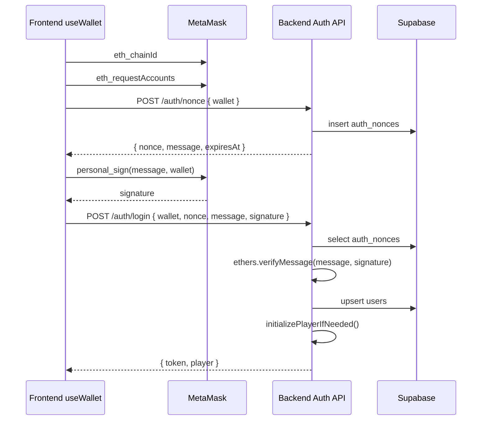
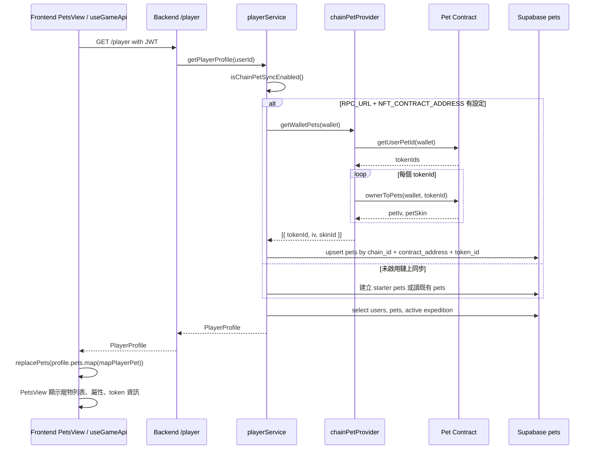
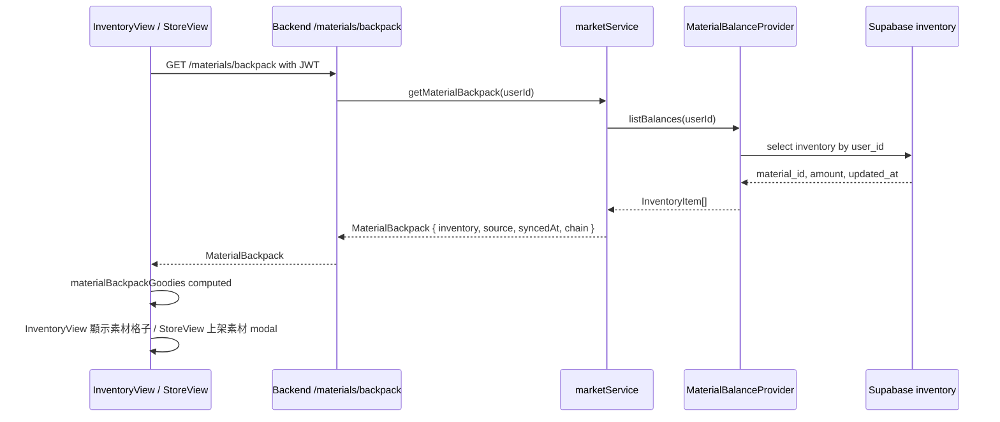
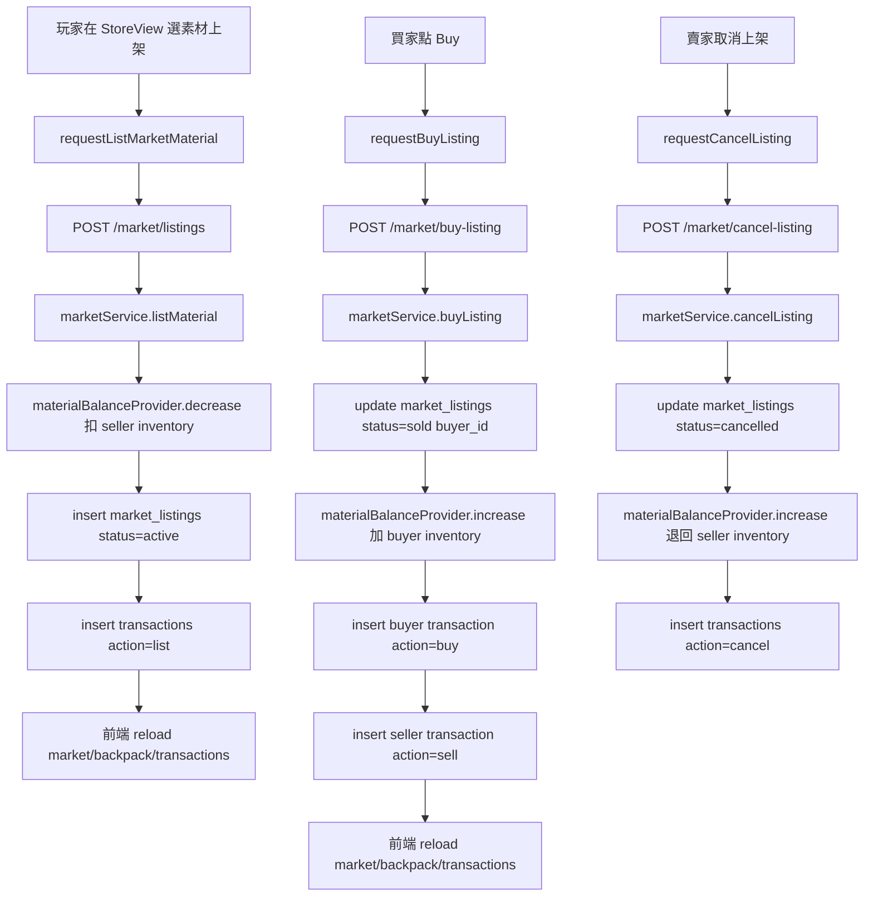
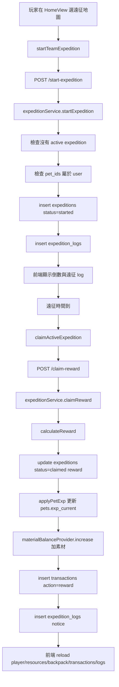

# CryptoPets 專案流程筆記

這份文件整理目前 repo 內能確認的專案流程、資料夾分工、資料庫/鏈上/前端資料流，以及目前後端實際透過哪些 function 讀寫資料。沒有從程式碼確認的地方會標成「待對齊」，避免把未實作的設計寫成既成事實。

## 0. 目前實作方向

本專案目前的鏈上/後端對齊原則：

- 後端的鏈上功能以 `contracts/` 現有合約介面為準，不另行假設尚未存在的 ABI。
- Pet 鏈上讀取目前對齊 `contracts/CryptoPets.sol`：
  - `getUserPetId(address who)`
  - `ownerToPets(address owner, uint256 petId)`
- 素材功能仍要實作，但目前素材背包與市場交易暫時維持資料庫呈現：
  - 背包讀寫 `inventory`
  - 市場讀寫 `market_listings` / `transactions`
  - 暫不直接讀 ERC-1155 balance 或呼叫鏈上市場合約交易
- 玩家登入後，後端會確保玩家至少能取得自己的水豚資料：
  - 非鏈上同步模式：建立一隻依 `userId + wallet` 產生的 unique local capybara。
  - 鏈上同步模式：同步錢包在 `CryptoPets` 合約裡擁有的 pet。
- 前端登入確認後會載入 `/player`，玩家可以知道自己有哪些水豚，並在網頁的寵物頁、遠征頁與登入禮物彈窗呈現。

## 1. 專案總覽

CryptoPets 是一個 Web3 寵物養成遊戲 monorepo。

目前主要流程是：

1. 前端 Vue App 讓玩家用 MetaMask 連線。
2. 前端向後端要求登入 nonce。
3. 玩家用錢包簽名 nonce message。
4. 後端用 `ethers.verifyMessage()` 驗簽，建立/取得 Supabase user，簽發 JWT。
5. 前端帶 JWT 呼叫遊戲 API。
6. 後端從 Supabase 讀寫遊戲狀態，並在有設定 `RPC_URL` 與 NFT 合約時同步鏈上 Pet。
7. 前端把 API 回傳資料轉成畫面狀態，顯示寵物、素材背包、遠征、市場、交易紀錄。

## 2. 資料夾負責內容

```text
.
├─ frontend/       Vue 3 + Vite + TypeScript 前端
├─ backend/        Express + TypeScript 後端 API
├─ contracts/      Solidity 合約與合約測試
├─ shared/         前後端共用 TypeScript 型別
├─ game-content/   遊戲內容定義與素材資源
└─ node_modules/   workspace 依賴
```

### frontend/

負責玩家看到的遊戲畫面與 API 呼叫。

重點檔案：

- `src/composables/useWallet.ts`
  - 處理 MetaMask 連線。
  - 讀 `eth_chainId`。
  - 呼叫 `eth_requestAccounts`。
  - 透過 `personal_sign` 簽後端 nonce message。
  - 呼叫後端 `/auth/nonce`、`/auth/login`。
  - 保存 JWT session。

- `src/api/game.ts`
  - 封裝遊戲 API：
    - `getPlayer()` -> `GET /player`
    - `getResources()` -> `GET /resources`
    - `getMaterialBackpack()` -> `GET /materials/backpack`
    - `startExpedition()` -> `POST /start-expedition`
    - `claimReward()` -> `POST /claim-reward`
    - `getMarketListings()` -> `GET /market/listings`
    - `listMarketMaterial()` -> `POST /market/listings`
    - `buyMarketListing()` -> `POST /market/buy-listing`
    - `cancelMarketListing()` -> `POST /market/cancel-listing`
    - `getTransactions()` -> `GET /transactions`

- `src/composables/useGameApi.ts`
  - 前端主要遊戲狀態中心。
  - 把 API 回來的資料轉成畫面需要的資料。
  - 會更新：
    - `playerProfile`
    - `resources`
    - `materialBackpack`
    - `marketListings`
    - `transactions`
    - `activeExpedition`
    - `expeditionLogs`

- `src/views/PetsView.vue`
  - 顯示 `/player` 回傳的 pets。
  - 可以選寵物、組遠征隊伍。
  - 若後端回報鏈上 Pet 未啟用，畫面會顯示提示，並改用後端可用的 pet data。

- `src/views/InventoryView.vue`
  - 顯示 `/materials/backpack` 回傳的素材背包。
  - 目前素材使用/丟棄/賣出等細部行為還是保留狀態，未接完整後端 API。

- `src/views/StoreView.vue`
  - 顯示市場掛單、自己的掛單、交易紀錄。
  - 上架素材會先從背包選素材，再呼叫後端建立 listing。
  - 買入/取消上架都透過後端 API 更新 Supabase。

- `src/views/HomeView.vue`
  - 遠征畫面。
  - 呼叫 `startTeamExpedition()` 開始遠征。
  - 呼叫 `claimActiveExpedition()` 領獎。
  - 顯示 expedition logs。

- `src/web3/chainData.ts`
  - 目前是不可用 provider：
    - `getWalletPets()` 回空陣列。
    - `getWalletGoodies()` 回空陣列。
  - 代表前端目前沒有直接讀鏈；鏈上資料主要由後端處理。

### backend/

負責 API、登入驗簽、Supabase 資料讀寫、鏈上 Pet 同步。

重點檔案：

- `src/routes/index.ts`
  - API 路由入口。

- `src/services/authService.ts`
  - `createLoginNonce(wallet)`
    - 建立 nonce、message、expiresAt。
    - 寫入 Supabase `auth_nonces`。
  - `loginWithSignature(input)`
    - 查 nonce。
    - 檢查 nonce 未過期、未使用。
    - 用 `ethers.verifyMessage(message, signature)` 還原錢包地址。
    - upsert `users`。
    - 簽發 JWT。
    - 呼叫 `initializePlayerIfNeeded()` 初始化玩家。

- `src/services/playerService.ts`
  - `initializePlayerIfNeeded(userId, wallet?)`
    - 若鏈上 Pet 同步啟用，呼叫 `syncOnChainPets()`。
    - 若鏈上 Pet 同步未啟用，建立 starter pets 到 Supabase `pets`。
    - 確保 `currencies` 有玩家資料。
  - `getPlayerProfile(userId)`
    - 讀 `users`。
    - 若鏈上 Pet 同步啟用，先同步鏈上 Pet。
    - 讀 `pets`。
    - 讀目前 active expedition。
    - 回傳給前端 `PlayerProfile`。
  - `syncOnChainPets(userId, wallet)`
    - 呼叫 `createChainPetProvider().getWalletPets(wallet)`。
    - 把鏈上 pet 映射成 Supabase `pets` rows。
    - 用 `upsert(..., onConflict: 'chain_id,contract_address,token_id')` 寫入。

- `src/services/chainPetProvider.ts`
  - 目前唯一真的從鏈上讀 Pet 的後端 provider。
  - 透過 `ethers.JsonRpcProvider(env.RPC_URL)` 建立 provider。
  - 透過 `new ethers.Contract(env.NFT_CONTRACT_ADDRESS, petAbi, provider)` 建立 contract。
  - `getWalletPets(wallet)` 目前期待呼叫：
    - `tokensOfOwner(address owner)` -> 回傳 `uint256[] tokenIds`
    - `getPet(uint256 tokenId)` -> 回傳 `iv`、`skinId`
  - 回傳資料：
    - `tokenId`
    - `iv`
    - `skinId`

- `src/services/materialBalanceProvider.ts`
  - 目前素材背包不是直接讀 ERC-1155，而是讀 Supabase `inventory`。
  - `listBalances(userId)` -> 讀 `inventory`
  - `increase(userId, materialId, amount)` -> 增加 `inventory.amount`
  - `decrease(userId, materialId, amount)` -> 減少 `inventory.amount`
  - `transfer(fromUserId, toUserId, materialId, amount)` -> DB 層轉移素材

- `src/services/marketService.ts`
  - `getPlayerResources()` -> 回傳 `sepoliaBalance: '0'` 與素材 inventory。
  - `getMaterialBackpack()` -> 回傳背包、來源、同步時間、material chain 設定資訊。
  - `getMarketListings()` -> 讀 active `market_listings`。
  - `listMaterial()` -> 扣 seller inventory，新增 listing，寫 transaction。
  - `cancelListing()` -> listing 改 `cancelled`，素材退回 seller inventory，寫 transaction。
  - `buyListing()` -> listing 改 `sold`，素材加到 buyer inventory，寫 buyer/seller transaction。
  - 目前 market 買賣沒有呼叫鏈上合約付款或 escrow；價格欄位以 Sepolia 顯示，但交易邏輯在 Supabase。

- `src/services/expeditionService.ts`
  - `startExpedition()` -> 檢查玩家 pet、建立 `expeditions`、建立 `expedition_logs`。
  - `claimReward()` -> 檢查遠征完成、計算 reward、更新 expedition、加 pet exp、加素材、寫 transaction/log。
  - `getExpeditionLogs()` -> 讀 `expedition_logs`。

- `supabase/schema.sql`
  - 資料庫 schema、index、RLS policy、updated_at trigger。

### contracts/

負責鏈上合約。

目前有兩個主要合約：

- `CryptoPets.sol`
  - 類 ERC-721 Pet 合約。
  - 主要 function：
    - `addPet(string petName, address to, uint8 petIv)`
    - `getTotalPet()`
    - `getUserPetId(address who)`
    - `getPet(uint256 petId)`
    - `getPetAttribute(uint256 petId)`
    - `setPetLevel(uint256 petId, uint256 level)`
    - `addCloth(uint8 clothId, address to, uint256 petId)`
    - `sellCloth(...)`
    - `ownerOf(uint256 tokenId)`
    - `balanceOf(address owner)`
    - `transferFrom(...)`
    - `safeTransferFrom(...)`
    - `listPet(...)`
    - `cancelPetListing(...)`
    - `buyPet(...)`
  - Pet struct：
    - `petId`
    - `petName`
    - `petIv`
    - `petLevel`
    - `petSkin`

- `CryptoMaterials.sol`
  - 類 ERC-1155 Material 合約。
  - 主要 function：
    - `mintMaterial(address to, uint256 materialId, uint256 amount)`
    - `increaseMaterial(address to, uint256 materialId, uint256 amount)`
    - `decreaseMaterial(address from, uint256 materialId, uint256 amount)`
    - `balanceOf(address account, uint256 materialId)`
    - `balanceOfBatch(address[] accounts, uint256[] ids)`
    - `safeTransferFrom(...)`
    - `safeBatchTransferFrom(...)`
    - `listMaterial(...)`
    - `cancelMaterialListing(...)`
    - `buyMaterial(...)`

部署資訊在 `contracts/DEPLOYMENTS.md`：

- Sepolia chain id: `11155111`
- `CryptoPets`: `0x8F71AddC5b56D148727d129F54e31d24f632CeD0`
- `CryptoMaterials`: `0xA6E9ec01E2fb1e82db2602719c13D2cC15446E56`

### shared/

負責前後端共用型別。

重要型別：

- `WalletAddress`
- `PlayerProfile`
- `PlayerPet`
- `MaterialBackpack`
- `MarketListing`
- `PlayerTransaction`
- `ExpeditionSummary`
- `ExpeditionReward`
- `AuthNonceResponse`
- `AuthLoginResponse`

這些型別讓 `frontend` 和 `backend` 使用同一份 API contract。

### game-content/

負責遊戲靜態內容與素材。

包含：

- `src/capybaras.ts`：starter pet / capybara 定義。
- `src/materials.ts`：素材定義。
- `src/stories.ts`：遠征故事事件。
- `src/lang/`：中英文文案。
- `assets/capybaras/`：寵物圖像。
- `assets/goodies/`：素材圖像。
- `assets/maps/`：遠征/市場地圖。
- `assets/audio/`：音樂。

後端會用 `@cryptopets/game-content` 驗證 material id、計算遠征、建立 starter pet；前端會用它渲染名稱、屬性、圖像與文案。

## 3. 資料庫分工

Supabase PostgreSQL 是目前 MVP 的主要狀態來源。

主要 table：

- `users`
  - 玩家帳號。
  - 以 wallet 唯一識別。

- `auth_nonces`
  - 錢包登入 challenge。
  - 保存 nonce、wallet、message、expires_at、used_at。

- `pets`
  - 玩家寵物資料。
  - 若鏈上 Pet 同步啟用，資料由後端讀鏈後 upsert。
  - 若未啟用，後端建立 starter pets。

- `currencies`
  - 玩家幣別資料。
  - 目前 coins 預設為 0。

- `inventory`
  - 素材背包。
  - 目前 `MaterialBalanceProvider` 直接讀寫這張表。

- `market_listings`
  - 市場掛單。
  - active/sold/cancelled 狀態都在這裡。

- `transactions`
  - 玩家交易紀錄。
  - 遠征獎勵、上架、購買、出售、取消都會寫入。

- `expeditions`
  - 遠征主資料。
  - 記錄 pet_ids、expedition_type、started_at、ends_at、status、reward。

- `expedition_logs`
  - 遠征事件與 reward notice。

- `friends` / `friend_requests`
  - 好友與好友邀請。

## 4. 最重要的鏈上資料流程圖

### 4.1 錢包登入流程



### 4.2 Pet 鏈上同步流程



目前後端實際抓鏈上 Pet 的 function：

- 後端檔案：`backend/src/services/chainPetProvider.ts`
- 後端 provider function：
  - `createChainPetProvider()`
  - `EthersChainPetProvider.getWalletPets(wallet)`
- 預期合約 function：
  - `getUserPetId(address who)`
  - `ownerToPets(address owner, uint256 petId)`
- 抓到資料：
  - `tokenId`
  - `iv`
  - `skinId`
- 寫入資料庫：
  - `pets.token_id`
  - `pets.contract_address`
  - `pets.chain_id`
  - `pets.base_pet_id`
  - `pets.iv`
  - `pets.skin_id`
  - `pets.name`
  - `pets.element`
  - `pets.stage`
  - `pets.token_uri`
  - `pets.stats`

### 4.3 Material 背包流程



目前 Material 沒有直接讀 ERC-1155。

後端目前使用：

- `SupabaseMaterialBalanceProvider.listBalances()`
- `SupabaseMaterialBalanceProvider.increase()`
- `SupabaseMaterialBalanceProvider.decrease()`
- `SupabaseMaterialBalanceProvider.transfer()`

目前讀寫資料：

- 讀：`inventory.material_id`、`inventory.amount`、`inventory.updated_at`
- 寫：`inventory.user_id`、`inventory.material_id`、`inventory.amount`、`inventory.updated_at`

`getMaterialBackpack()` 會回傳 chain 設定資訊：

- `source`: `local-db` 或 `chain-db`
- `chain.enabled`
- `chain.chainId`
- `chain.materialContractAddress`

但目前即使 `source` 顯示和鏈有關，實際素材數量仍由 `inventory` 提供。

### 4.4 市場流程



目前市場流程沒有呼叫 `CryptoMaterials.listMaterial()`、`buyMaterial()`、`cancelMaterialListing()`；買賣資料是 Supabase 內的 MVP 流程。

### 4.5 遠征流程



遠征 reward 目前會產生：

- `exp`
- `sepoliaAmount: '0.00000000001'`
- `materials`

但寫入 transaction 時：

- `coin_amount` 目前寫 `0`
- `sepoliaAmount` 放在 `metadata`
- 素材透過 Supabase `inventory` 增加

## 5. 前端如何呈現後端資料

### Pet 顯示

資料來源：

- `GET /player`
- `useGameApi.loadPlayerProfile()`
- `mapPlayerPet()`
- `replacePets()`

呈現：

- `PetsView.vue`
  - 寵物格子
  - 隊伍 slot
  - 屬性、HP、EXP
  - token id / base pet id / skin id 等 API 映射後資料
- `HomeView.vue`
  - 遠征隊伍與 pet 卡片

### Material 顯示

資料來源：

- `GET /materials/backpack`
- `useGameApi.loadMaterialBackpack()`
- `materialBackpackGoodies`

呈現：

- `InventoryView.vue`
  - 背包格子。
  - 顯示素材名稱、grade、amount、來源、syncedAt。
- `StoreView.vue`
  - 上架素材 modal。
  - 只列出背包中 amount > 0 的素材。

### Market 顯示

資料來源：

- `GET /market/listings`
- `GET /transactions`
- `useGameApi.loadMarketListings()`
- `useGameApi.loadTransactions()`

呈現：

- `StoreView.vue`
  - 可購買 listing。
  - 自己的 active listing。
  - 最近交易紀錄。

### Expedition 顯示

資料來源：

- `GET /player` 的 `activeExpedition`
- `GET /expedition/logs`
- `POST /start-expedition`
- `POST /claim-reward`

呈現：

- `HomeView.vue`
  - 遠征地圖選擇。
  - 倒數。
  - 進度條。
  - 遠征 log。
  - Claim reward button。

## 6. 目前鏈上整合狀態

### 已有

- 前端錢包登入：
  - MetaMask account。
  - MetaMask chain id。
  - `personal_sign`。

- 後端驗簽：
  - `ethers.verifyMessage()`。

- 後端 Pet 鏈上 provider：
  - `chainPetProvider.ts`
  - 使用 `ethers.JsonRpcProvider` 與 `ethers.Contract`。

- 合約：
  - `CryptoPets.sol`
  - `CryptoMaterials.sol`
  - Sepolia 部署資訊。

### 目前未直接鏈上化

- Material 背包目前讀 Supabase `inventory`，不是 ERC-1155 `balanceOf`。
- Market 目前讀寫 Supabase `market_listings`、`transactions`、`inventory`，不是鏈上 escrow。
- 前端 `src/web3/chainData.ts` 目前是 unavailable provider，不直接讀鏈。
- Expedition reward 的 Sepolia amount 目前是 reward metadata，沒有實際鏈上轉帳。

## 7. 重要待對齊事項

這些是從目前程式碼看到的實際落差，建議後續優先確認。

### 7.1 後端 Pet provider 已改為對齊 contracts/

後端 `backend/src/services/chainPetProvider.ts` 目前以 `contracts/CryptoPets.sol` 現有介面為準：

```ts
'function getUserPetId(address who) view returns (uint256[])'
'function ownerToPets(address owner, uint256 petId) view returns (uint256 petId, string petName, uint8 petIv, uint256 petLevel, uint8 petSkin)'
```

讀取流程：

1. `getUserPetId(wallet)` 取得玩家持有的 pet token ids。
2. 對每個 token id 呼叫 `ownerToPets(wallet, tokenId)`。
3. 取出 `petIv` 與 `petSkin`。
4. 後端轉成 `tokenId`、`iv`、`skinId` 後 upsert 到 Supabase `pets`。

仍需注意：

- 目前同步只使用鏈上 `petIv` 與 `petSkin`。
- 顯示名稱、屬性、技能、圖片仍由 `game-content` 的 base pet 定義補齊。

### 7.2 Material 鏈上 provider 尚未實作

`CryptoMaterials.sol` 有：

```solidity
balanceOf(address account, uint256 materialId)
balanceOfBatch(address[] accounts, uint256[] ids)
```

但後端目前沒有 `ChainMaterialBalanceProvider`。`MATERIAL_BACKPACK_SOURCE=chain-db` 目前只影響 response 裡的 chain metadata，不會真的改成讀 ERC-1155。

### 7.3 市場鏈上付款尚未串接

`CryptoMaterials.sol` 有：

```solidity
listMaterial(uint256 materialId, uint256 amount, uint256 price)
cancelMaterialListing(uint256 listingId)
buyMaterial(uint256 listingId)
```

但目前 `marketService.ts` 的上架、取消、購買全部是 Supabase 流程。若要變成鏈上市場，要再設計：

- listing id 如何對應 DB 與鏈上 listing。
- 前端何時呼叫合約交易。
- 後端如何驗證 tx hash / event。
- DB 何時改 `active`、`sold`、`cancelled`。
- 失敗或 rollback 怎麼處理。

### 7.4 Sepolia balance 目前不是鏈上 balance

`marketService.getPlayerResources()` 目前固定回：

```ts
sepoliaBalance: '0'
```

遠征 reward 會顯示 `0.00000000001 Sepolia`，但 transaction 的 `coin_amount` 目前仍寫 `0`，沒有實際鏈上轉帳。

## 8. API 對照表

| API | 後端 function | 讀/寫 | 前端使用 |
| --- | --- | --- | --- |
| `POST /auth/nonce` | `createLoginNonce` | 寫 `auth_nonces` | `useWallet.connectWallet` |
| `POST /auth/login` | `loginWithSignature` | 讀寫 `auth_nonces`, `users`, 初始化 player | `useWallet.connectWallet` |
| `GET /player` | `getPlayerProfile` | 讀 `users`, `pets`, `expeditions`; 可同步鏈上 pet | `PetsView`, `HomeView`, `StoreView` |
| `GET /resources` | `getPlayerResources` | 讀 `inventory` | `InventoryView`, `useGameApi` |
| `GET /materials/backpack` | `getMaterialBackpack` | 讀 `inventory` | `InventoryView`, `StoreView` |
| `POST /start-expedition` | `startExpedition` | 寫 `expeditions`, `expedition_logs` | `HomeView` |
| `POST /claim-reward` | `claimReward` | 更新 `expeditions`, `pets`, `inventory`, `transactions`, `expedition_logs` | `HomeView` |
| `GET /expedition/logs` | `getExpeditionLogs` | 讀 `expedition_logs` | `HomeView` |
| `GET /market/listings` | `getMarketListings` | 讀 `market_listings` | `StoreView` |
| `POST /market/listings` | `listMaterial` | 更新 `inventory`; 寫 `market_listings`, `transactions` | `StoreView` |
| `POST /market/cancel-listing` | `cancelListing` | 更新 `market_listings`, `inventory`; 寫 `transactions` | `StoreView` |
| `POST /market/buy-listing` | `buyListing` | 更新 `market_listings`, `inventory`; 寫 `transactions` | `StoreView` |
| `GET /transactions` | `getPlayerTransactions` | 讀 `transactions` | `StoreView` |
| `POST /add-friend` | `friendService` | 讀寫 friends/friend_requests | `PetsView` / `useGameApi` |
| `GET /friends` | `friendService` | 讀 friends | `PetsView` / `useGameApi` |

## 9. 一句話版本

目前這個專案的主幹是「前端錢包登入 + 後端 JWT + Supabase 遊戲狀態」，鏈上部分已經有 Pet/Material 合約與 Pet 同步 provider 的雛形，但真正穩定運作前，需要先對齊 `chainPetProvider` 期待的合約 ABI 與現有 `CryptoPets.sol` 實作；Material、Market、Sepolia reward 目前主要還是 DB MVP 流程。
